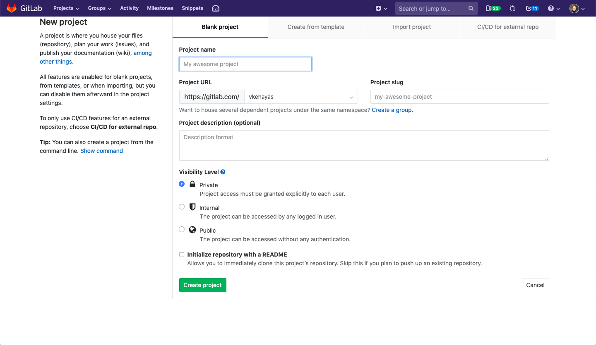

+++
title = "Git for scientists"

date = 2019-02-17
lastmod = 2019-02-17
draft = false

tags = ["git", "code", "software"]
summary = "A tool for source control, collaborative editing, and archiving"
abstract = "A tool for source control, collaborative editing, and archiving"
authors = ["Vassilis Kehayas"]
hasPlotly = false
doi = "10.5281/zenodo.2567578"
sourceFile = "src/git-intro.Rmd"

+++


Git is a source control tool developed
for the needs of the Linux kernel project.
Many software projects are now using the Git protocol 
as is evident by the popularity of services such as GitHub, GitLab and BitBucket
that rely on Git.
But its usefulness extends far beyond managing computer code.
Through this ~~collection of memes~~ article,
I will introduce the basics of using Git,
focusing on how it can be useful for academic research.
But first some motivation on why a better tool 
for scientific collaboration is needed.
If you are rather convinced that this is the case,
feel free to skip the motivation section
and move directly to the section describing 
[basic Git usage](#basic-command-line-usage).

{}

## Motivation

Scientific practice needs to  

* be collaborative
* be documented
* be open
* be amenable to revision
* include verifiable computer code

Scientists need to collaborate
in a way that gracefully and robustly handles concurrent editing.
Common practices to handle even simple cases 
of single-file versioning edited by few collaborators are cumbersome.
An example that should be familiar to all academic researchers 
is to have a folder piled with versions of a single document like this:  

```
final.doc
final_v1.doc
final_v1_VK.doc
final_v1_VK_XY.doc
final_v2.doc
...
final_v99.doc
final_for_real.doc
```



You can, of course, use the "track changes" feature in a text editor such as
Microsoft Word or LibreOffice,
but that results in unnecessary file duplication like the one shown above
and is not manageable once the project involves more than one author.
This method can be very slow as you would need to wait for 
all authors to send their version to someone whose version serves as the master
who then must re-send the merged version to the rest of collaborators.
The purpose of distributed source control systems, 
such as Git, is to enable multiple people to work 
on the same project in parallel or asynchronously.
In combination with using a central online repository,
everyone can have immediate access to the latest master version,
while at the same time working on their private copies.

In addition to the file versioning problem discussed above,
computer code for scientific research is often filled with comments like this:

```
# do_thing0
do_thing1
# do_thing2 # Was useful when I used to do_thing0 instead of do_thing1
```
Putting your code under version control with a tool such as Git
allows you to restore previous versions of your code with little effort.

Another example where traditional methods of 
ad-hoc version control are inadequate is multi-file versioning,
such as when some piece of code, documentation, 
the associated raw data, and the produced images
all change together.
When you place reproducible documents, such as 
[Rmarkdown](https://rmarkdown.rstudio.com) or 
[Jupyter notebooks](https://jupyter.org),
under version control with a tool such as Git, 
you can handle any changes to some of the pieces of a project in one step.

What happens if you edit a paragraph of your precious manuscript or code
only to realize that a previous version was better?
Sure, syncing services such as Dropbox have saved the day for me
in some instances with their version history feature,
but I have had to re-write parts of a piece of text or code almost equally often
in cases where the version I was looking for 
was older than the versions kept in history.
Git offers ease of mind regarding data loss,
though without removing the need for backups,
as it makes it very difficult for someone to lose data by accident.
As long as you regularly commit your changes,
you need advanced skills to re-write Git history. 

Collaborating on a single document 
stored in a syncing service such as Dropbox 
is asking for trouble,
as even with two collaborators file conflicts are to be expected.
Simultaneously editing a file in Google Docs,
although admirably powerful,
can be very distractive
as a change introduced by someone may disrupt 
another person's work.
But with Git every collaborator is working with a private copy,
or branch as we will later see.
Changes inside a private branch do not affect other branches.
Git includes tools for merging divergent branches
and a streamlined conflict resolution method
for the unavoidable merge conflicts.

## What Git offers

At the most basic level, Git automatically tracks the answers to the questions:  

* What has changed?
* Who made the change?
* When was the change made?

and in addition motivates you to answer the question  

* Why did it change/ What is this change about?  

when you commit a change.

When you use Git as a researcher,
you get a free, feature-full, shareable notebook for text-based work.

A side-effect of using Git is that I feel more productive,
as I can keep track of my work in chunk-sized achievements
when browsing my projects' Git log.  

## Basic command line usage

People often describe Git as a cryptic and complicated tool:



Such complaints are not without reason.
Just look at the list of all possible commands (excluding subcommands):

<code>
<div style="height: 600px; overflow-y: auto;">

```bash
git help -a
```

```
## usage: git [--version] [--help] [-C <path>] [-c <name>=<value>]
##            [--exec-path[=<path>]] [--html-path] [--man-path] [--info-path]
##            [-p | --paginate | -P | --no-pager] [--no-replace-objects] [--bare]
##            [--git-dir=<path>] [--work-tree=<path>] [--namespace=<name>]
##            <command> [<args>]
## 
## available git commands in '/usr/libexec/git-core'
## 
##   add                       merge-recursive
##   am                        merge-resolve
##   annotate                  merge-subtree
##   apply                     merge-tree
##   archive                   mergetool
##   bisect                    mktag
##   bisect--helper            mktree
##   blame                     mv
##   branch                    name-rev
##   bundle                    notes
##   cat-file                  pack-objects
##   check-attr                pack-redundant
##   check-ignore              pack-refs
##   check-mailmap             patch-id
##   check-ref-format          prune
##   checkout                  prune-packed
##   checkout-index            pull
##   cherry                    push
##   cherry-pick               quiltimport
##   clean                     read-tree
##   clone                     rebase
##   column                    rebase--helper
##   commit                    receive-pack
##   commit-graph              reflog
##   commit-tree               remote
##   config                    remote-ext
##   count-objects             remote-fd
##   credential                remote-ftp
##   credential-cache          remote-ftps
##   credential-cache--daemon  remote-http
##   credential-store          remote-https
##   describe                  repack
##   diff                      replace
##   diff-files                request-pull
##   diff-index                rerere
##   diff-tree                 reset
##   difftool                  rev-list
##   difftool--helper          rev-parse
##   fast-export               revert
##   fetch                     rm
##   fetch-pack                send-pack
##   filter-branch             serve
##   fmt-merge-msg             sh-i18n--envsubst
##   for-each-ref              shortlog
##   format-patch              show
##   fsck                      show-branch
##   fsck-objects              show-index
##   gc                        show-ref
##   get-tar-commit-id         stage
##   grep                      stash
##   hash-object               status
##   help                      stripspace
##   http-fetch                submodule
##   http-push                 submodule--helper
##   index-pack                symbolic-ref
##   init                      tag
##   init-db                   unpack-file
##   interpret-trailers        unpack-objects
##   log                       update-index
##   ls-files                  update-ref
##   ls-remote                 update-server-info
##   ls-tree                   upload-archive
##   mailinfo                  upload-pack
##   mailsplit                 var
##   merge                     verify-commit
##   merge-base                verify-pack
##   merge-file                verify-tag
##   merge-index               web--browse
##   merge-octopus             whatchanged
##   merge-one-file            worktree
##   merge-ours                write-tree
## 
## git commands available from elsewhere on your $PATH
## 
##   shell
## 
## 'git help -a' and 'git help -g' list available subcommands and some
## concept guides. See 'git help <command>' or 'git help <concept>'
## to read about a specific subcommand or concept.
```
</div>
</code>

What could `merge-octopus` possibly mean?
I freely admit that I did not know what this command was for
before writing this post,
and I still do not know what many of the other commands do.
Luckily, you only need a few commands to get by for basic use.



I will first describe some basic commands for use through a terminal.
However, many text editors or IDE's now offer 
a way to use these basic commands through a guided user interface.
For more advanced usage, 
there are even standalone graphical git clients
and we will see some examples of graphical interfaces for Git 
later in this post.

To install Git, if it is not already installed in your system,
follow the instructions in this link:  
https://git-scm.com/book/en/v2/Getting-Started-Installing-Git.

The first thing you need to do next is 
to go to a terminal (or command window in Windows)
and enter the following lines,
replacing the placeholder text with your full name and email address,
to introduce yourself to Git:


```bash
git config --global user.name "Full Name"
git config --global user.email "demo@email.com"
```
Optionally, you can also set the default text editor to your favourite one.
I use the terminal-based nano

```bash
git config --global core.editor "nano -w"
```
but you could also use a graphical editor such as [Atom](https://atom.io/)

```bash
git config --global core.editor "atom --wait"
```
You can find a list of configuration commands 
for some popular editors with a graphical user interface
in https://swcarpentry.github.io/git-novice/02-setup/.

You only need to set these options once in every computer
and they will be valid for all your repositories.

Git repositories are folders that you have instructed Git to track.
You can achieve this for a folder like so:


```bash
mkdir git-demo # Create folder
cd git-demo # Move to that folder
git init # Tell Git to start watching this folder
```

```
## Initialized empty Git repository in /builds/neurathsboat.blog/posts/git-intro/git-intro/src/git-demo/.git/
```

Git has created a hidden folder called `.git` inside `git-demo`
in which it will store all the files it needs to keep track of the repository.


```bash
ls -la
```

```
## total 24
## drwxr-xr-x    3 root     root          4096 Feb 17 21:43 .
## drwxr-xr-x    3 root     root          4096 Feb 17 21:43 ..
## drwxr-xr-x    7 root     root          4096 Feb 17 21:43 .git
```

If you ever delete this hidden folder 
all info Git had on your repository will be gone.
To check the status of our repository we can run the following line:

```bash
git status
```

```
## On branch master
## 
## No commits yet
## 
## nothing to commit (create/copy files and use "git add" to track)
```

By default, Git creates a branch called `master` in which it will hold
all future changes unless told otherwise.
A branch is a collection of *commits*.
A commit is simply a snapshot of the repository's history.
Currently, there are no commits to show
--let's create one.
To do that, first I need to create a new file, called `test.txt`,
and write something in it.
I will only write the word "spam".


```bash
touch test.txt # Create file
echo spam >> test.txt # Write "spam" inside test.txt
cat test.txt # Display file contents
```

```
## spam
```
Now Git reports that it found the new file:

```bash
git status
```

```
## On branch master
## 
## No commits yet
## 
## Untracked files:
##   (use "git add <file>..." to include in what will be committed)
## 
## 	test.txt
## 
## nothing added to commit but untracked files present (use "git add" to track)
```

You can create or edit files 
in a git repository as you normally would,
for example through a graphical text editor.
You can continue adding or editing files, 
until you feel you need to keep 
the repository's contents in Git history.
There are typically two steps to follow.
First, you need to `stage` the changes,
which provides a way to select 
which of all the available changes 
to the files or portions of files you have made
are to be kept in Git history.  


```bash
git add test.txt
git status
```

```
## On branch master
## 
## No commits yet
## 
## Changes to be committed:
##   (use "git rm --cached <file>..." to unstage)
## 
## 	new file:   test.txt
```
Once we are happy with our changes,
we need to tell Git to record this version in its history for good:


```bash
git commit -m "Include spam"
```

```
## [master (root-commit) 2dfd064] Include spam
##  1 file changed, 1 insertion(+)
##  create mode 100644 test.txt
```


By using the `-m` flag, 
which stands for "message",
we are permanently attaching 
the description that follows it
to the changes made.
Using this command, Git will commit the staged changes
but not any changes you made to the staged files
after you staged them.


```bash
git log --graph --pretty=format:'%h <%an> %s%d'
# Show a graph log with the short commit hash, the author, the commit message and the commit reference
```

```
## * 2dfd064 <Neurath's boat> Include spam (HEAD -> master)
```

There is an art to writing descriptive yet concise Git commit messages.
One guiding principle could be to write in the imperative present tense
(e.g. "Fix indentation in preprocessing block"),
as if trying to complete the sentence
"If applied, this commit will ...".
For more on the subject of commit messages,
see https://chris.beams.io/posts/git-commit/.



Now suppose that your text or code becomes complex enough
that you may need to edit different parts of the file or multiple files
at the same time.
This may also be the case if a collaborator wants
to edit the same files as you.
But you still want to have a master version (branch)
of your project that contains 
the last state of the project that is known to work or 
that everyone has provisionally accepted.
The way to achieve this with Git is to create a separate branch
that will contain the new versions of the files you wish to edit.


```bash
git checkout -b develop
```

```
## Switched to a new branch 'develop'
```
With the above command, I created a new branch called `develop`
and switched to it.
As it stands, it is in exactly the same state as the `master` branch.
But now any file edits will not propagate to the `master` branch,
unless you want to.


```bash
echo "I am developing" >> test.txt
cat test.txt
```

```
## spam
## I am developing
```

Calling `git status` now shows that our file is modified
compared to the previous state:


```bash
git status
```

```
## On branch develop
## Changes not staged for commit:
##   (use "git add <file>..." to update what will be committed)
##   (use "git checkout -- <file>..." to discard changes in working directory)
## 
## 	modified:   test.txt
## 
## no changes added to commit (use "git add" and/or "git commit -a")
```

We can issue `git diff` to observe the changes:


```bash
git diff test.txt
```

```
## diff --git a/test.txt b/test.txt
## index 34b6a0c..8c5bb19 100644
## --- a/test.txt
## +++ b/test.txt
## @@ -1 +1,2 @@
##  spam
## +I am developing
```

The output shows us that Git has detected the inserted new line of text.

We can preserve our edits by staging and committing the file changes,
this time in one step by additionally using 
the `-a` flag, which stands for `add`,
together with the `-m` flag for `git commit` we used before:

```bash
git commit -am "Include asinine statement"
```

```
## [develop 5104b5e] Include asinine statement
##  1 file changed, 1 insertion(+)
```

If for some reason we change our minds and decide to revert the file
to the state it was before our latest commit
we can use


```bash
git checkout HEAD~1 test.txt
cat test.txt
```

```
## spam
```

which instructs Git to revert the file `test.txt` to the state it was
one commit before the latest (the `HEAD`).
To revert a file to a specific time in history
we first list the different commits


```bash
git log --graph --pretty=format:'%h <%an> %s%d'
```

```
## * 5104b5e <Neurath's boat> Include asinine statement (HEAD -> develop)
## * 2dfd064 <Neurath's boat> Include spam (master)
```

and then `checkout` the commit that corresponds 
to the version we are looking for:
`git checkout 2dfd064 test.txt`.
To revert more than one files at the same time
some care should be taken to avoid the 
[dreaded "detached head" state](https://www.atlassian.com/git/tutorials/undoing-changes).

To revert back to the latest state of the file Git has recorded
we simply `checkout` the branch's `HEAD`

```bash
git checkout HEAD test.txt
```

At some point, we will feel that our edits are complete.
We can then merge the changes we made in the `develop` branch
with the `master` branch.
First, we need to switch back to the `master` branch
and then use the git command `merge`:

```bash
git checkout master
git merge develop
```

```
## Switched to branch 'master'
## Updating 2dfd064..5104b5e
## Fast-forward
##  test.txt | 1 +
##  1 file changed, 1 insertion(+)
```

```bash
git log --graph --pretty=format:'%h <%an> %s%d'
```

```
## * 5104b5e <Neurath's boat> Include asinine statement (HEAD -> master, develop)
## * 2dfd064 <Neurath's boat> Include spam
```

Here we merged a local branch to another local branch stored in the same machine.
But say you want to send your changes to a collaborator.
There are many ways to do this, for example by 
[emailing a patch](https://git-scm.com/docs/git-send-email) 
that contains the differences between your edits and the master version,
or directly through Git itself.
However, it is more convenient if there is an authoritative version
that everyone can easily access.

## Remote git repositories

This is where online services such as GitHub and GitLab come in.
Both GitHub and GitLab offer free public repositories with many useful features.
Although GitHub is by far the most popular such service,
I prefer GitLab as it is open source 
which means that, among other benefits,
it can be self-hosted if need-be, 
it offers unlimited private repositories without restrictions 
on the number of collaborators,
and it is more focused on providing 
a complete toolchain for project development out of the box.
However, the basic setup I will describe next is exactly the same 
for either remote service.

While anyone can view public GitLab projects,
you need to [create an account](https://gitlab.com/users/sign_in)
to create or interact with a hosted project.
Interacting with your GitLab repository outside its own web interface
will be simplified if you create an SSH key pair,
if you do not already have one:


```bash
ssh-keygen -o -t rsa -b 4096 -C "demo@email.com"
```
and 
[associate the public key with your GitLab account](https://docs.gitlab.com/ee/gitlab-basics/create-your-ssh-keys.html).

You will encounter the following screen when navigating to the 
[project creation page](https://gitlab.com/projects/new):



After creating your project,
GitLab conveniently lists the commands you need to run 
to sync your repository with their servers:


In our case, we already have a local Git project set up
so we just need to link it to the GitLab project.
To achieve this, we need to add the GitLab project 
as a remote repository to our local repository
and push the changes:


```bash
git remote add origin git@gitlab.com:neurathsboat/git-demo.git
git push -u origin --all
git push -u origin --tags
```

Next time we make some changes that we need to sync with GitLab,
we only need to run the following command after our commit:

```bash
git push origin master
```
or simply 

```bash
git push
```
that uses `origin` as the default remote and `master` as the default branch.
When we want to make sure that we are working with 
the most current version of a repository we need to pull from GitLab:


```bash
git pull
```

and continue working as described above.

Now that we have a shared remote repository,
when we want to merge a local branch 
with the master branch of the remote repository
we can open a [*merge request*](https://docs.gitlab.com/ee/gitlab-basics/add-merge-request.html)
(or *pull request* in GitHub's terminology).
The main difference with a local merge as the one we performed before
is that now collaborators of a project are free 
to submit a new merge request,
or to review an existing merge request
and suggest improvements or comments
on the merge request as a whole:


or for particular pieces of it:


Some other benefits of using a service such as GitLab 
that we will not expand on more in this post are
[issues](https://docs.gitlab.com/ee/user/project/issues/)
and 
[Kanban boards](https://docs.gitlab.com/ee/user/project/issue_board.html#overview),
that it provides an extra place to backup your code, text, and small data,
and 
[continuous integration/continuous development](https://docs.gitlab.com/ee/ci/README.html).

## Guided user interfaces

Despite the flexibility it offers,
using the command line is a deterrent for some people.
However, everything that we have done so far with Git and even more
can be performed from inside the comfort of a modern text editor, 
IDE (not you, MATLAB), 
or dedicated software application.

Here is a screenshot of the Git panel inside the 
[Atom text editor](https://atom.io):


in [Rstudio](https://www.rstudio.com/products/RStudio/):


and [GitKraken](https://www.gitkraken.com/git-client):


## A more detailed description of Git plumbing

For anyone who wishes to go slightly deeper 
into the workings of Git here is a summary of
the operations we have used in this tutorial,
described in more detail.

  

We can describe a Git repository as 
an array of sequentially connected objects
that each stores different kinds of information 
about the state of a project.
The working directory represents the state of the local filesystem.
Git internally uses a database of files named through a 
[hash function](https://en.wikipedia.org/wiki/Hash_function), 
called blobs, 
that contain the content of the tracked files in your filesystem
for a given Git repository.
The staging area, or Index, corresponds to a special Git object, called 
a [Git tree](https://git-scm.com/book/en/v2/Git-Internals-Git-Objects),
that collects states of the files you have specified through `git add`.
To permanently store the contents of your staged files in the Git repository,
you run `git commit`, 
which creates a commit object that updates the staging area
and references the trees and the commits that came before it.
Since each recorded state of a repository can be referenced by a commit hash,
any such state can be reinstated by `git checkout`.
By default, Git creates a `master` branch
that automatically tracks the latest commit or HEAD.
But you can make the HEAD track another branch or commit 
that deviates from `master`
by using `git checkout some-pre-existing-branch-name`
or `git checkout -b branch-that-will-be-created`.
Later, you can switch back to the `master` (or any other branch)
by using `git checkout master` which will again point the HEAD 
to the last known state of the `master` branch.
When you merge branch `B` into branch `A` with 

```bash
git checkout A
git merge B
```
you are specifying that you wish for the history of branch `B`
to be a part of branch `A`.
For an interactive version of the above schematic
which also includes commands that we have not covered in this post see
http://ndpsoftware.com/git-cheatsheet.html.

A remote repository is just another Git repository
(technically a *bare* repository, 
i.e. one without a working directory
since no one is directly writing to its filesystem).
To include in your local repository any newer changes 
that a remote repository contains,
you need to `git fetch` to download the data
and then `git merge` to merge them to your local state,
or use `git pull` to perform both operations at once.
The reverse operation, 
i.e. publishing your local state to a remote repository, 
can be achieved by `git push`.

## Managing your project's development

Git branches are easy to create and to eliminate,
and are really useful when you need to work 
on an isolated copy of your work,
whether that is to fix a bug or build a new feature.
As it is almost always desirable to keep a master branch in a stable state,
it is useful to offload development 
to at least one branch dedicated to that purpose.
As the project becomes more complicated
and involves several collaborators,
[branching strategies](https://git-scm.com/book/en/v2/Git-Branching-Branching-Workflows)
such as 
[Gitflow](https://nvie.com/posts/a-successful-git-branching-model/) 
provide a streamlined way to develop code.
Choosing a branching strategy involves making several choices
such as how long-lived or short-lived 
and how many different types of development branches
the project should have,
and whether one or more branches 
dedicated to released code should be provisioned.
Which strategy to choose depends,
among other considerations,
on the scope of the project and the number of collaborators involved.

A basic Git feature which allows tracking important 
points in your development history
is the concept of tags,
which mark specific commits in an easily accessible way
for future reference.
A tag reference is similar to a branch reference
except that it always points to the same commit.
Using tags raises the issue of how they should be named.
Although the name of a Git tag can in principle be anything you like,
it makes sense to follow some convention in producing them
to allow for information about the content of the tag
to be instantly extracted from the tag name.
You could use some rule based on the date of the commit
but that would be superfluous
as the commit object already includes this information.
A very popular alternative is to use the rules set forth by 
[semantic versioning](https://semver.org).
Tags that follow semantic versioning consist of three numbers X.Y.Z.
An increment in each of those numbers
signifies something about the state of the project. 
X corresponds to a major version
which means that each new X marks a breaking change,
one that is incompatible with previous versions.
Y corresponds to a minor version 
which should be updated every time you add 
a new feature or functionality to a given major version.
Z corresponds to a patch version
which contains changes needed to resolve a bug.
Just by reading these three numbers
your project's users can already know
what a new version has to offer
and whether to expect breaking changes.

To create a tag from the current state of a branch
you can run

```bash
git tag -a v1.1.0 -m "version 1.1.0"
```
and to tag any commit

```bash
git tag -a v1.1.0 de17b1e -m "version 1.1.0"
```
where `de17b1e` is the commit's short hash.

Tags are not transmitted to a remote by `git push`
but you can run

```bash
git push origin --tags
```
to do so.

## Git for non-code text

Putting your manuscripts and other text-based files
under Git can be rewarding,
as long as you take some considerations into account.
While Git can track any file that you instruct it to,
with some file formats you are not getting the most out of Git.
An example that is relevant to many academics is Microsoft Word's
native file format, DOCX.
Since a DOCX file is a compressed XML file,
`diff`ing a DOCX file is not very informative

```
diff --git a/test.docx b/test.docx
index af57f2d..c0520bc 100644
Binary files a/test.docx and b/test.docx differ
```
While there are 
[methods to improve what Git can show in diffs](https://git-scm.com/book/en/v2/Customizing-Git-Git-Attributes)
for different file types,
better ways to write your manuscripts in the first place also exist, 
especially if you plan to source-control them (and you should). 
Since Git is meant to work best with simple text files,
you should consider plain text formats.
[$\LaTeX$](https://en.wikipedia.org/wiki/LaTeX) offers some useful features,
but it is more involved than needed in some circumstances.
A simpler file format specification is
[Markdown](https://daringfireball.net/projects/markdown/)
which was initially designed as a text-to-HTML formatting syntax. 
The primary goal of Markdown is to enable
writing human-readable text that can then be converted to HTML.
Since its inception, many extensions have been added
to the specification to allow for commonly used features
such as math, citations, and code highlighting.
As a result, Markdown has gained popularity
as a format from which to convert text to many output formats.
To go one step further 
it is recommended to use tools such as Jupyter notebooks or RMarkdown,
both based on Markdown,
to write scientific documents
that involve computation
accompanied by some explaining text.

Whatever text format you choose,
following some best practices can improve the experience.
Since Git is designed for code,
it is not optimized out of the box
to handle non-code text.
Git will look for whole line differences 
and store them as such.
That works well for code as each line 
is usually a self-contained command,
or it should be.
But a line of non-code text can be very long 
and changes of any size
may trigger detection.
If you do not separate each sentence to its own line,
Git will treat whole paragraphs as a single line.
If two people edit different sentences of a paragraph
it will lead Git to treat those changes as a merge conflict.
A simple way of mimimizing such conflicts is to 
break your text into lines of sentences or even short phrases.
You can achieve this by pressing <kbd>Enter</kbd>
to separate lines.
The end result, whether rendered in HTML, PDF, DOCX, or another format,
is not affected as these whitespace characters are not taken into account
during conversion.

Another useful strategy involves 
breaking changes in your text into manageable chunks.
Especially for long documents such as theses or books,
it makes sense to split them into several different files,
for example following their natural division into chapters.
Even in a single-file case,
it makes sense to work on sizable changes in separate branches.
Doing so can allow you, for example, 
to always have a ready-to-share version, say in the master branch,
while you keep working on not-yet-ready revisions in a separate branch.
It can be also useful, especially if you ever wish to easily revert them,
to make document-wide changes such as replacing a term with another
in a single commit.
In all cases, such strategies allow 
grouping of logically related changes,
which makes the job of tracking and reverting them so much easier.


## Outlook

By now we hope you should be convinced that Git is
<ul>
<li>a better way to undo changes</li>
<li>a better way to collaborate than emailing files back and forth</li>
<li>a better way to share your code 
and other scientific work with the world</li>
</ul>

If the whole idea of merge requests reminds you of academic peer review,
except in a more streamlined form,
that is because the process is truly
a perfect way to overhaul academic discourse.
Although it's not the usual practice in research,
using hosting is a great way to invite other people to collaborate with you.
For examples of how collaborative publications might look like
see https://andrewgyork.github.io/ and 
this website in conjunction with its 
[source repository](https://gitlab.com/neurathsboat.blog/neurathsboat.blog).
Even open source and completely free 
to publish and to read journals have been
created using Git and hosted Git repositories, such as 
[The Journal of Open Source Software (JOSS)](http://joss.theoj.org).
In their
[announcement blog post](http://arfon.org/announcing-the-journal-of-open-source-software)
the editors of JOSS cite the following passage from Buckheit and Donoho (1995):

> An article about computational science
in a scientific publication is not the scholarship itself, 
it is merely advertising of the scholarship. 
The actual scholarship is 
the complete software development environment 
and the complete set of instructions which generated the figures.

In fact, I envision a day when all scientific communication will be done
through a service such as GitLab.

## TL;DR  


```bash
git init
git add .
git commit -m "Commit message"
git remote add origin git@gitlab.com:account/git-demo.git
git push -u origin master
```
then

```bash
git pull origin master
# Now make your edits
git add .
git commit -m "Commit message"
git push origin master
```

## Acknowledgements  

This article has heavily borrowed material from 
Software Carpentry's tutorial on Git
which can be found in
https://swcarpentry.github.io/git-novice/.


## References  

Buckheit, Jonathan B., and David L. Donoho. 1995. "WaveLab and
Reproducible Research." In *Wavelets and Statistics*, edited by Anestis
Antoniadis and Georges Oppenheim, 55--81. New York, NY: Springer New
York. <https://doi.org/10.1007/978-1-4612-2544-7_5>.
